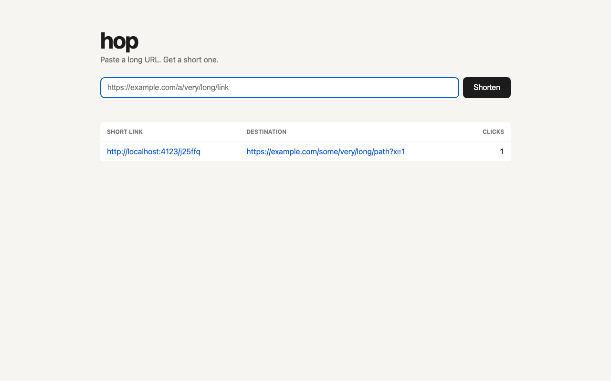
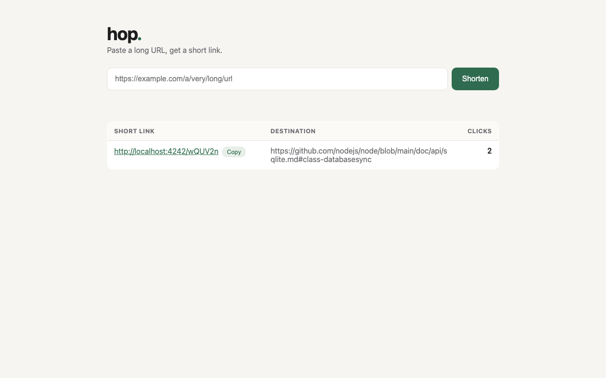
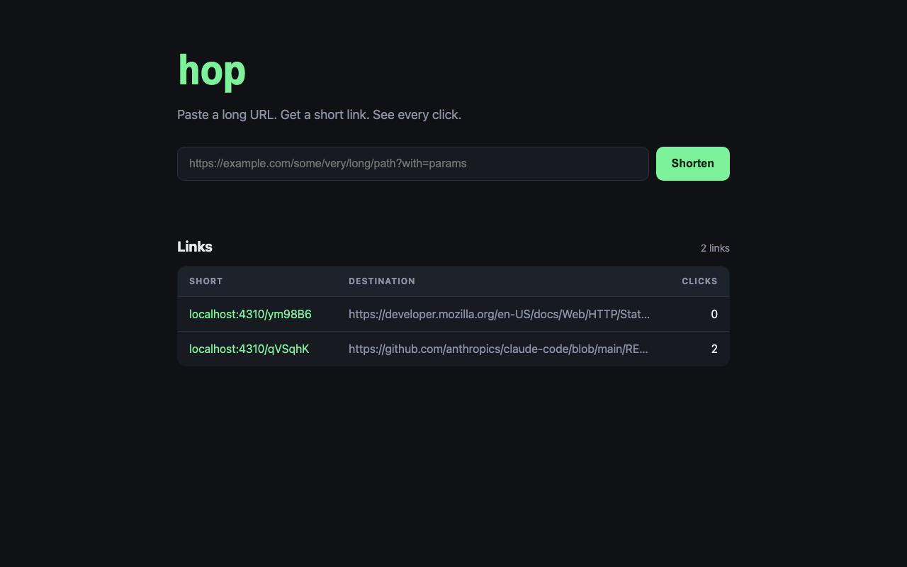

import { Tabs, TabItem, Steps, Aside } from '@astrojs/starlight/components';

**The idea.** A coding agent with no instructions will build you something. It will be different from what the person next to you got, and different from what you would get if you ran it again. That is not a flaw in the model. It is what happens when the only specification is one sentence.

**Time:** about 60 minutes. 15 for the talk, 30 for the build, 15 to compare.

## The talk

Three things to say before anyone types.

1. **What a factory is.** The four stations: isolate, build, prove, ship. Why the idea is harness and model agnostic. See [What a software factory is](/software-factory-workshop/start/what-a-factory-is/).
2. **Why we start with a sandbox.** Everyone in the room has a different harness configuration: skills they wrote, plugins they installed, memory the harness has accumulated. For the comparison in this act to mean anything, everyone has to start from nothing. For the rest of the workshop, it means the only guardrails in play are the ones you add on purpose.
3. **Why we start by vibe coding.** You cannot appreciate a guardrail until you have seen what happens without it. Every act after this one adds one thing and shows what changed. This act is the baseline.

## Hands-on

<Steps>

1. **Make an empty folder and start your sandboxed harness in it.** You set the alias up in [Before you arrive](/software-factory-workshop/start/before-you-arrive/). The `hop` folder sits next to `software-factory-workshop`, both inside `~/workshop`. The ledger path in step 2 (`../software-factory-workshop/tools/ledger/ledger.mjs`) depends on that.

   ```bash
   cd ~/workshop && mkdir hop && cd hop
   git init -b main
   ```

   <Tabs syncKey="harness">
     <TabItem label="Claude Code">
       ```bash
       claude-workshop
       ```
       Confirm there is nothing loaded: type `/skills` and `/mcp`. Both should be empty.
     </TabItem>
     <TabItem label="Codex CLI">
       ```bash
       codex-workshop
       ```
       Type `/mcp` to confirm no servers are loaded.
     </TabItem>
     <TabItem label="Gemini CLI">
       ```bash
       gemini-workshop
       ```
       Type `/mcp list` and `/skills list` to confirm both are empty.
     </TabItem>
     <TabItem label="Cursor">
       ```bash
       agent-workshop
       ```
       Run `agent-workshop mcp list` in another terminal to confirm no servers are loaded.
     </TabItem>
   </Tabs>

2. **Start counting the cost.** Open a second terminal and `cd ~/workshop/hop`. You cloned the workshop repository on the [Before you arrive](/software-factory-workshop/start/before-you-arrive/) page, so the ledger is already on your machine. Run it from `hop`. It finds your project from the current folder.

   The ledger reads your harness's own local logs and shows tokens and API-equivalent cost by model. Nothing is sent anywhere. Run it again at the end of each act and watch the number move.

   <Tabs syncKey="harness">
     <TabItem label="Claude Code">
       ```bash
       node ../software-factory-workshop/tools/ledger/ledger.mjs
       ```
       With the sandboxed Claude Code, point it at the sandbox's logs by setting `CLAUDE_CONFIG_DIR` the same way the alias does.

       ```bash
       CLAUDE_CONFIG_DIR=~/.claude-workshop node ../software-factory-workshop/tools/ledger/ledger.mjs
       ```
     </TabItem>
     <TabItem label="Codex CLI">
       The ledger reads Claude Code's log format only, so it cannot read Codex CLI logs. Use Codex CLI's own usage view. `npx ccusage@latest` also has a `codex` command (`npx ccusage@latest codex`), which its own help lists as showing Codex token usage.
     </TabItem>
     <TabItem label="Gemini CLI">
       The ledger reads Claude Code's log format only, so it cannot read Gemini CLI logs. Use Gemini CLI's own usage view. `npx ccusage@latest` also has a `gemini` command (`npx ccusage@latest gemini`), which its own help lists as showing Gemini CLI usage.
     </TabItem>
     <TabItem label="Cursor">
       The ledger reads Claude Code's log format only, so it cannot read Cursor logs. Use Cursor's own usage view. The help text of `npx ccusage@latest` does not list Cursor today.
     </TabItem>
   </Tabs>

   The full story is on [Counting the cost](/software-factory-workshop/reference/counting-the-cost/).

3. **Give it this prompt, exactly as written.** Do not add anything. Do not answer questions it asks with anything more than "you choose".

   ```text
   Build me a short link service called hop. I paste a long URL, it gives me a short link, and visiting the short link redirects to the long URL. Show how many times each link was clicked.
   ```

4. **When it says it is done, run it and try it.** Paste a link, click the short one, and check the count went up. If it does not work, tell the agent so and let it fix it. Note how many turns that took.

5. **Take a screenshot of the home page.** Start the app first, and leave it running. Playwright can take the screenshot from the command line; replace the port with yours. Do this before you commit, so the screenshot is part of the commit.

   ```bash
   npx -y playwright@latest screenshot --viewport-size=1280,800 http://localhost:3000 screenshot.png
   ```

6. **Commit what you have and tag it.** You will come back to this point. Stop the app, then look at `git status` first. If you see `node_modules` or a database file (such as `hop.db`) listed, and the agent did not add a `.gitignore`, create one that lists them before you commit.

   ```bash
   git status
   git add -A
   git commit -m "Vibe-coded hop from one prompt"
   git tag act-1
   ```

</Steps>

## What you see

Now compare with the people around you. Stack, folder layout, port, how data is stored, whether there are tests, what the page looks like.

When this guide was built, the prompt above was given to three agents at the same time, each with a different model and no instructions. Here is what came back.

| | Run 1 | Run 2 | Run 3 |
|---|---|---|---|
| Dependencies | none | none at runtime, ESLint for development | Express |
| Layout | flat files | `src/` with an app factory | flat files |
| Storage | SQLite file in the working folder | SQLite file in `data/` | SQLite file in `data/` |
| Port | 4123 | 4242 | 4310 |
| Lines of code | 279 | 444 | 721 |
| Tests | 1, end to end | 5, with an in-memory database | 5, with an in-memory database |
| Extras | | copy button | copy button, auto-refresh, dark theme |





All three work. All three pass their own tests. None of them share an API shape, a folder layout or a look. If you asked an agent to add a feature to all three, it would have to learn each one from scratch.

<Aside type="note" title="An honest note on divergence">
These three runs all came from models in the same family, and they still disagreed on framework, layout and style. A room full of different harnesses and models diverges more. The point stands either way: nothing about the result was decided by you.
</Aside>

<Aside type="note" title="What this act cost to build">
- API-equivalent cost of this act's window: $15.20 (approximate).
- By model: Fable 5.1 $14.83, Opus 5.5 $0.22, Sonnet 5.5 $0.15.
- Main session $7.16, subagents $8.04 (53% subagents).
- The window also holds docs and research work done at the same time, so treat it as approximate.

Everything ran on the most expensive model, and nothing yet steers work to a cheaper one. Run the ledger now and compare your own number.
</Aside>

## What to take into act 2

Keep your `hop` folder. Act 2 adds the first guardrail to it: a file that tells the agent how to work here, and a skill that says what the code should look like. The feature you add then will land the way you want it, and you will be able to say why.

If your build did not work and you would rather start from a known point, the demo repository at the `act-1` tag is run 3 above.

```bash
git clone https://github.com/bendechrai/hop-demo.git hop
cd hop && git checkout act-1
```
