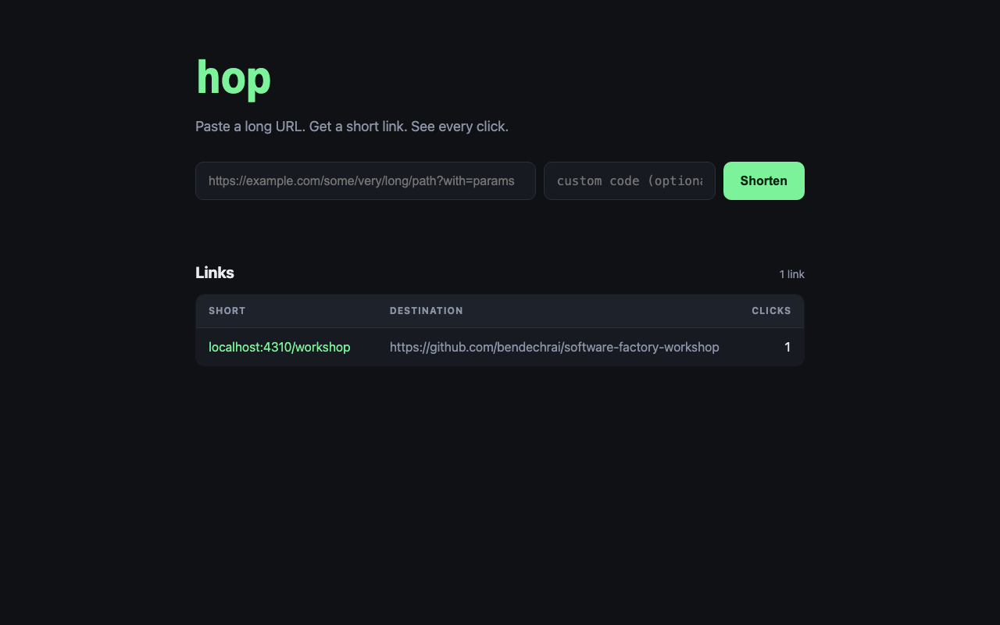

import { Tabs, TabItem, Steps, Aside, Code, FileTree } from '@astrojs/starlight/components';
import agentsMd from '../../../../../templates/act-2/AGENTS.md?raw';
import skillMd from '../../../../../templates/act-2/.agents/skills/code-structure/SKILL.md?raw';

**The idea.** The first guardrail is a file the harness reads before every turn. Most people fill it with facts about the codebase, which the agent can read for itself. The useful content is the opposite: how you want work done here, and what never happens. The second guardrail is a skill, a named piece of guidance the agent pulls in when it writes code, so that code written by any agent on any model reads as if one careful person wrote it.

**Time:** about 75 minutes. 20 for the talk, 40 hands-on, 15 to compare.

## The talk

1. **Instructions are non-deterministic guardrails.** They shape behaviour. They do not guarantee it. That is fine; the deterministic ones come in act 3. The job of this file is to make the common case go right.
2. **Workflow, not wiki.** The agent can read `package.json`. It cannot read your mind about whether to ask before restructuring, or whether "it should work" counts as verified. Write down the things it cannot infer.
3. **One file for every harness.** Codex and Cursor read `AGENTS.md` natively. Claude Code reads it when there is no `CLAUDE.md`. Gemini reads it with a two-line setting. See [The four harnesses](/software-factory-workshop/reference/harnesses/).
4. **Skills are the same idea, scoped.** A skill is a folder with a `SKILL.md`: frontmatter saying when to use it, then the guidance. The code-structure skill is the one that pays for itself fastest.

## The files

The workflow file. Read it as an attendee would; everything in it is a decision you could make differently.

<Code code={agentsMd} lang="md" title="AGENTS.md" />

The code-structure skill. Three layers, with a table of what each one owns and never does.

<Code code={skillMd} lang="md" title=".agents/skills/code-structure/SKILL.md" />

## Hands-on

<Steps>

1. **Copy the two files into your `hop` folder, and tell your harness about them.** Run these from your hop folder. The skill lives in `.agents/skills/`, which three of the four harnesses read. Claude Code gets a symbolic link.

   ```bash
   curl -fsSL https://raw.githubusercontent.com/bendechrai/software-factory-workshop/main/templates/act-2/AGENTS.md -o AGENTS.md
   mkdir -p .agents/skills/code-structure
   curl -fsSL https://raw.githubusercontent.com/bendechrai/software-factory-workshop/main/templates/act-2/.agents/skills/code-structure/SKILL.md -o .agents/skills/code-structure/SKILL.md
   ```

   <Tabs syncKey="harness">
     <TabItem label="Claude Code">
       ```bash
       mkdir -p .claude && ln -s ../.agents/skills .claude/skills
       ```
       Do not create a `CLAUDE.md`. With none present, Claude Code 2.1.277 and later read `AGENTS.md` as the project instructions. If you must have one, its first line should be `@AGENTS.md`.
     </TabItem>
     <TabItem label="Codex CLI">
       Nothing more to do. `AGENTS.md` and `.agents/skills/` are Codex's own conventions.
       Written from the docs, not run.
     </TabItem>
     <TabItem label="Gemini CLI">
       ```bash
       mkdir -p .gemini
       curl -fsSL https://raw.githubusercontent.com/bendechrai/software-factory-workshop/main/templates/act-2/.gemini/settings.json -o .gemini/settings.json
       ```
       Commit that file. It tells Gemini to read `AGENTS.md`; `.agents/skills/` is read without a setting.
       Written from the docs, not run.
     </TabItem>
     <TabItem label="Cursor">
       Nothing more to do. Cursor reads `AGENTS.md` at the root and skills in `.agents/skills/`.
       Written from the docs, not run.
     </TabItem>
   </Tabs>

   ```bash
   git add -A && git commit -m "Add the workflow file and the code-structure skill"
   ```

2. **Start your harness and check it loaded them.** Ask it: "What does AGENTS.md say about verification?" If it answers from the file, you are set.

3. **First prompt: bring the vibe-coded app into line.** This is the part most people skip. Guardrails only apply to new code unless you say otherwise.

   ```text
   Read AGENTS.md and the code-structure skill. Bring this codebase in line with them without changing what the app does: TypeScript, the three layers, numbered SQL migrations applied by `npm run migrate`, and an `npm run verify` that runs typecheck, lint and the unit tests. Keep the existing tests passing (port them to TypeScript if you need to). Add a `.env.example` for the variables the app reads. Run TypeScript directly with Node, no build step. The server entry point is src/server.ts and reads PORT and HOP_DB (HOP_DB=:memory: must work). The server applies pending migrations when it starts.
   ```

   The last three sentences are a contract that the browser test in act 3 depends on. Guardrails are also how a team's apps converge: if every app starts the same way, one test can start any of them.

   Let it finish. Run `npm run verify` yourself. Commit.

4. **Second prompt: add a feature under the guardrails.**

   ```text
   Add custom short codes. When creating a link, the user can optionally type their own code: 3 to 32 characters, letters, digits and hyphens only. If the code is already taken, tell them so and do not create the link. Show the field in the form on the home page.
   ```

   Run `npm run verify` yourself. Commit and tag.

   ```bash
   git tag act-2
   ```

</Steps>

## What you see

Open the diff of the second commit. This is what it looked like on the demo app.

<FileTree>
- src
  - actions
    - create-link.ts the rule: is the code valid, is it taken
    - validate-code.ts extracted on its second use
    - fake-links.ts a fake service for the action tests
    - create-link.test.ts 6 tests, no database
    - follow-link.test.ts
  - routes
    - links.ts parses `code` from the body, maps conflict to 409
  - services
    - links.ts **unchanged**
- public
  - index.html the new field
  - app.js
</FileTree>

Three things to notice.

- **The rule is in one place, and it is not the route.** Whether a code is valid and whether it is taken are decided in an action. The route only turned "conflict" into a 409. The database service did not change at all.
- **The tests sit where the skill said.** The action is tested with a fake service, six cases, no database. The agent did not write one giant end-to-end test because the skill told it where tests go.
- **The agent quoted its verification.** The summary ended with the command it ran after its last edit and the exit code, because the workflow file asked for exactly that.



Compare with act 1. Same model, same app, same kind of request. The difference is two markdown files.

<Aside type="note" title="What the first prompt did to the demo app">
The restructuring touched 43 files: 2132 lines added, 268 removed. It converted to TypeScript with no build step (Node strips the types), split the flat files into routes, actions and services, moved the schema into a numbered migration, and added a `verify` script. Behaviour and the JSON shape of the API did not change, and the ported tests passed. It took the agent one pass.
</Aside>

<Aside type="note" title="What this act cost to build">
- API-equivalent cost of this act's window: $5.16 (approximate).
- By model: Fable 5.1 $5.16.
- Main session $4.15, subagents $1.02 (20% subagents).
- The window also holds docs and research work done at the same time, so treat it as approximate.

Most of this act's cost (80%) was the main session, because the orchestrator was still doing work itself. Run the ledger now and compare your own number.
</Aside>

## What you take into act 3

The agent now builds the way you asked. Nothing yet stops it from committing something that fails the checks, or from saying it ran them when it did not. That is act 3.
