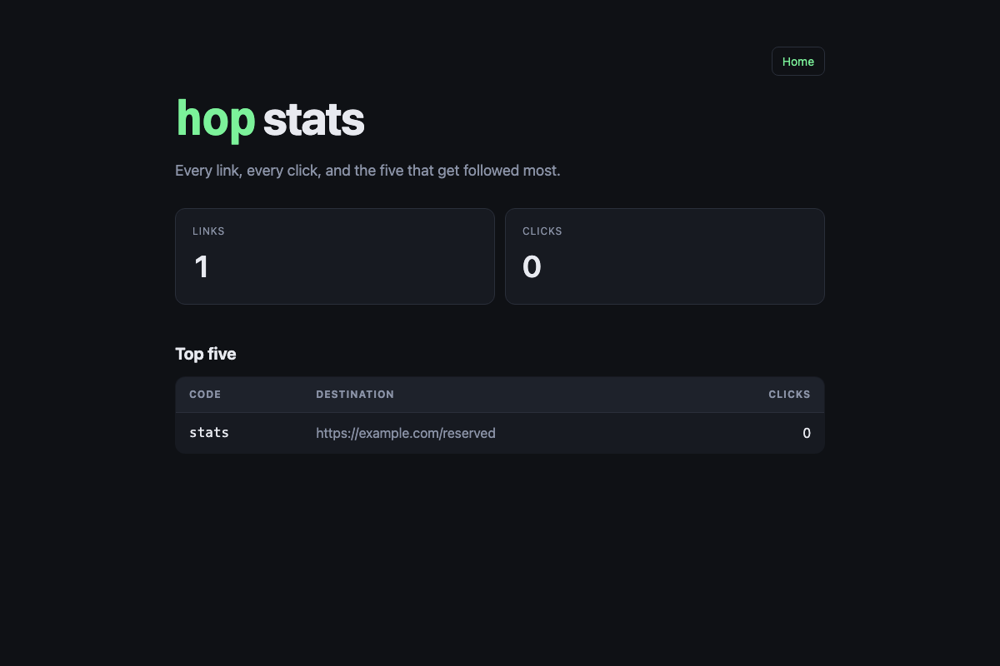
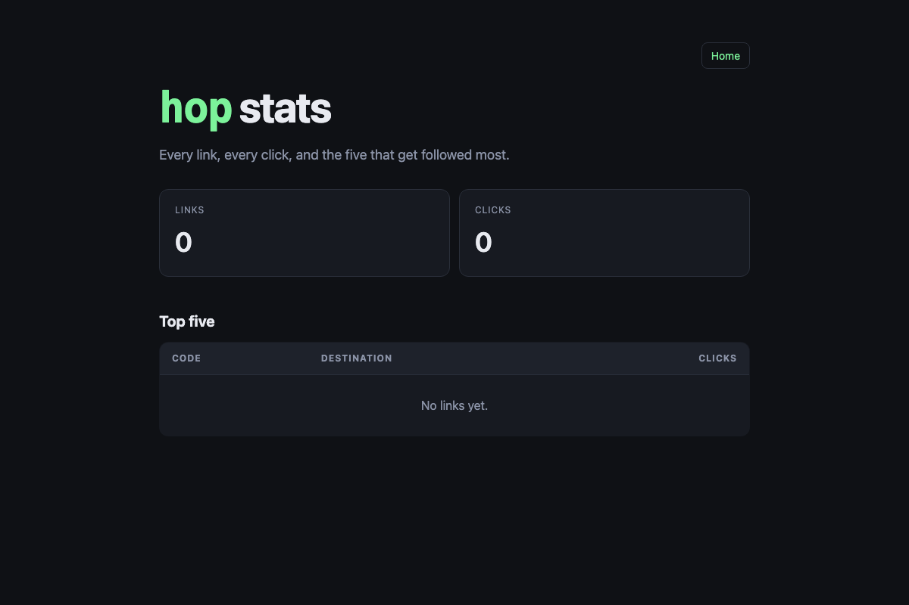
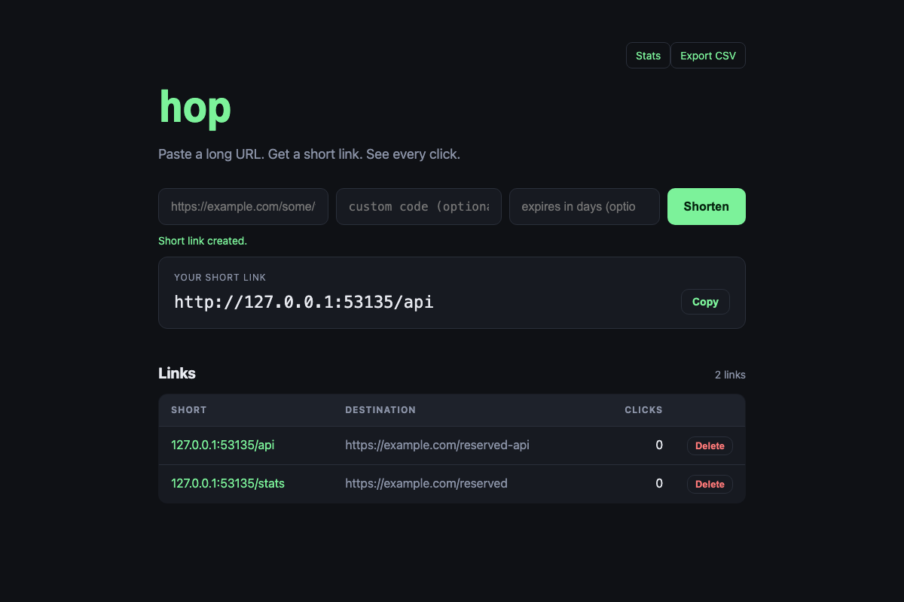
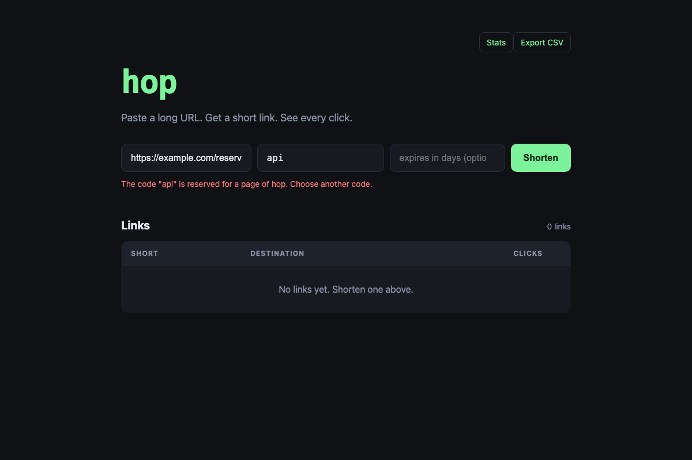

import { Steps, Code, Aside } from '@astrojs/starlight/components';
import skill from '../../../../../templates/act-7/.agents/skills/evidence/SKILL.md?raw';

**The idea.** Agents cannot pinky promise. "Tests pass" and "it should work" are claims, and an agent can talk its way around a claim. So work is not done until it shows evidence an agent cannot talk its way around. A fix shows the bug on the old commit and its absence on the new one, captured the same way. This is the "prove" station from the popular version of the factory, and the popular version is right. This workshop adds one rule: the evidence names the commit it was captured against.

**Time:** about 55 minutes. 15 for the talk, 30 hands-on, 10 to compare.

## The talk

1. **Three kinds of evidence.** A fix shows the bug on the old commit, then shows it gone on the new one, with the same steps. A visible change shows before and after screenshots of the page it touches. A non-visible change shows a measurement or test output pair, before and after. Pick the kind first. It decides what you capture.
2. **Claims go stale.** Vinzenz Eiberger checked 101 "tests pass" claims from his coding agents. About a third were not true. Most were stale: the checks passed, then the code changed, and nobody ran them again. A claim has no commit attached. Evidence does. Read the audit: [I checked 101 "tests pass" claims from my AI coding agents](https://dev.to/vinzenz_eiberger/i-checked-101-tests-pass-claims-from-my-ai-coding-agents-35-werent-true-h6n).
3. **Capture each side from a clean checkout of a named commit.** The tool checks the ref out into its own worktree, starts the app there and runs the steps. Uncommitted edits are never in the picture. The record it writes holds the full commit, the short commit and the time. That is the rule this workshop adds. A screenshot with no commit is a picture. A screenshot with a commit can be checked.
4. **The agent must look at its own after screenshot.** If the after does not show the intended result, the work is not done, and the agent goes back to building. That is the factory loop: build, prove, look, and build again if the proof fails. For a fix, the before must show the bug. If it does not, the agent has not reproduced it. It says so and stops.
5. **Never fake it.** No scripted playback that always looks right. No mock-up. No edited image. If a record is wrong, fix the steps and capture again. Never edit a record by hand.

## The files

Two files. The tool is `bin/evidence.mjs`. It uses `chromium` from `@playwright/test`, which `hop` already has, so nothing new is installed. A failed expectation still exits 0 and is written into the record. A setup error exits 1 and a usage error exits 2. The skill tells agents when and how to use it. Agents load it before they open any pull request.

<Code code={skill} lang="md" title=".agents/skills/evidence/SKILL.md" />

You also add one line to `AGENTS.md`, in step 4 of the Workflow list:

```text
A PR is not opened without the Evidence section the `evidence` skill describes.
```

The tool takes a steps file. This is the help text from the demo run:

```text
Usage: node bin/evidence.mjs --ref <git ref> --out <dir> --name <label> --script <steps.json>

  --ref     commit, branch or tag to capture, for example origin/main or HEAD
  --out     folder for the screenshots and the <label>.json record
  --name    label for this run, for example before or after
  --script  JSON file holding a list of steps, run in order:
              { "goto": "/path" }
              { "fill": "<selector>", "value": "text" }
              { "click": "<selector>" }
              { "expectText": "text", "selector": "<selector>" }   selector defaults to body
              { "screenshot": "<name>" }                           saved as <label>-<name>.png
              { "request": { "method": "POST", "path": "/api/x", "body": {} }, "expectStatus": 201 }

The app runs with HOP_DB=:memory: on a free port. Exit 0 even when an
expectation fails; each step records ok true or false.
```

## Hands-on

You are the orchestrator and the reviewer. Use your `hop` repository from act 6, clean, on `main`. The fix PR in this act stays open. It is the input to act 8.

<Steps>

1. **Copy the tool and the skill in, and add the line to `AGENTS.md`.**

   ```bash
   cd hop
   base=https://raw.githubusercontent.com/bendechrai/software-factory-workshop/main/templates/act-7
   mkdir -p bin .agents/skills/evidence
   curl -fsSL "$base/bin/evidence.mjs" -o bin/evidence.mjs
   curl -fsSL "$base/.agents/skills/evidence/SKILL.md" -o .agents/skills/evidence/SKILL.md
   ```

   Add the `AGENTS.md` line above. The demo run also gave `bin/**/*.mjs` the Node globals in `eslint.config.js`, so the tool is linted. That change is not in the template folder, so make it yourself if your lint run complains. Check the tool with `node bin/evidence.mjs --help`. Commit and push. On the demo run the pre-commit hook and the pre-push gate both passed.

2. **Reproduce the known bug by hand first.** Act 5's stats-page design recorded a gap: a custom code that matches a page of the app can be created, and then the page hides its short link. Start the app with `HOP_DB=:memory:` and try it.

   ```bash
   curl -s -X POST localhost:4390/api/links \
     -H 'content-type: application/json' \
     -d '{"url":"https://example.com/reserved","code":"stats"}'
   ```

   On the demo run this returned 201. Then `GET /stats` returned 200 with the stats page, `<title>Stats - hop</title>`, and no redirect. The link exists and can never be reached. Do not write a fix until you have seen this.

3. **Propose `reserved-codes`.** Use the propose command from act 4. On the demo run it made a new capability, `custom-codes`, and one task group, "1. Reserve route names", with tasks 1.1 to 1.4. Task 1.4 is the evidence task. Validate it with `openspec validate reserved-codes --strict`, read it and commit it.

4. **Import the ticket, make the worktree, write the failing tests.**

   ```bash
   agentboard import-change reserved-codes --as orch
   agentboard claim <ticket id> --as impl-1
   git fetch origin
   git worktree add ../hop.worktrees/fix-reserved-codes-g1 -b fix/reserved-codes-g1 origin/main
   cd ../hop.worktrees/fix-reserved-codes-g1
   npm ci
   ```

   Write the tests first and watch them fail. On the demo run the first `npm run test` exited 1, as it should.

5. **Fix it.** The demo run kept one list of reserved codes in `src/actions/reserved-codes.ts`: `api`, `app`, `index`, `stats`, `style`. Matching ignores case, because Express routes ignore case. A trailing `+` gets its own message. `createLink` returns `invalid` and the route turns that into a 400. A test fails if a file in `public/` has no entry in the list. `npm run verify` passed with 64 tests, and `E2E_PORT=4391 npm run e2e` passed with 9. Commit the code first.

6. **Write the steps file** at `evidence/reserved-codes/steps.json`. It has an `expectStatus` or `expectText` on each thing that should change, and a screenshot of each page.

   ```json
   [
     { "request": { "method": "POST", "path": "/api/links", "body": { "url": "https://example.com/reserved", "code": "stats" } }, "expectStatus": 400 },
     { "request": { "method": "GET", "path": "/api/links/stats" }, "expectStatus": 404 },
     { "goto": "/stats" },
     { "screenshot": "stats" },
     { "goto": "/" },
     { "fill": "#url", "value": "https://example.com/reserved-api" },
     { "fill": "#code", "value": "api" },
     { "click": "button[type=submit]" },
     { "expectText": "reserved", "selector": "#message" },
     { "screenshot": "home-api" }
   ]
   ```

7. **Capture the before on `origin/main` and the after on `HEAD`.** Run both from the repo root of your ticket worktree, with the same steps file.

   ```bash
   node bin/evidence.mjs --ref origin/main --out evidence/reserved-codes --name before --script evidence/reserved-codes/steps.json
   node bin/evidence.mjs --ref HEAD --out evidence/reserved-codes --name after --script evidence/reserved-codes/steps.json
   ```

   Both exited 0 on the demo run. The before had failures and still exited 0, because the failures are the bug, on record.

8. **Look at the screenshots and read the records.** Open all four images and read `after.json`. The next section says what the demo run showed. If the after had not shown the fix, this is the point to go back to step 5.

9. **Commit the evidence** on the branch: the steps file, both records, every screenshot. The demo run ticked task 1.4 in the same commit.

10. **Open the PR with an Evidence section, and hand off.** Push through the gate, then `gh pr create --base main`. The body has a table of what was checked, with the short commit from each record, then the records, then the images. The real table is in the next section. Link the PR on the board and hand it to the reviewer.

    ```bash
    agentboard link <ticket id> --pr 3 --as impl-1
    agentboard handoff <ticket id> --to ben --status review --note "<PR url, what to look at>" --as impl-1
    ```

    Do not merge. The fix PR stays open for act 8, which reviews it.

11. **Tag.** `main` already has the tooling, so tag it now, from the main checkout.

    ```bash
    cd ../hop
    git tag act-7
    ```

</Steps>

## What you see

This is the table from the PR body, as the run wrote it. The short commits come from the records.

| Checked | Before | After |
| --- | --- | --- |
| POST /api/links with code `stats` | `4104b00`: 201, link created | `1d8c491`: 400, "The code "stats" is reserved for a page of hop. Choose another code." |
| GET /api/links/stats | `4104b00`: 200, the link exists | `1d8c491`: 404, no link stored |
| GET /stats | `4104b00`: 200, stats page (the `stats` link is shadowed, no redirect) | `1d8c491`: 200, stats page, 0 links |
| Home form with code `api` | `4104b00`: "Short link created." | `1d8c491`: "The code "api" is reserved for a page of hop. Choose another code." |

The two records agree with it. `before.json` has 7 ok and 3 failed, and the 3 failures are the bug. `after.json` has 10 ok and 0 failed.

The four screenshots, in the order the PR shows them.



Before, `/stats` at `4104b00`. The "hop stats" page shows LINKS 1 and CLICKS 0. The Top five table has one row: code `stats`, pointing to https://example.com/reserved, 0 clicks. The link exists, but `/stats` shows the page and not a redirect. The bug is reproduced.



After, `/stats` at `1d8c491`. The same page with LINKS 0, CLICKS 0 and "No links yet." The `stats` link was refused.



Before, home form with `api` at `4104b00`. A green "Short link created." message, the short link `http://127.0.0.1:53135/api`, and 2 links listed: `/api` and `/stats`.



After, home form with `api` at `1d8c491`. The code field still holds `api`. A red message says `The code "api" is reserved for a page of hop. Choose another code.` The list shows 0 links and "No links yet. Shorten one above."

Three findings from the run are worth your attention.

- **The tool needed proof too.** Run from inside a ticket worktree, `bin/evidence.mjs` put its checkout in the wrong folder: `hop.worktrees/fix-reserved-codes-g1.worktrees/` and not `hop.worktrees/`. The run exposed it. The fix finds the main checkout through `git rev-parse --git-common-dir`. It went onto `main` as `4104b00`, and the branch was rebased onto it. The lesson: tools in the factory need proof as well. A tool that makes evidence can be wrong, and the only way to find out is to run it the way it will be used.
- **Task 1.4 was ticked slightly before the PR existed.** The evidence task was ticked in the evidence commit, and the PR that links the images was created straight afterwards. For a short gap that is harmless. It is still a claim made a moment before its proof, so look for it in review.
- **The before was captured at a later commit than act 6.** The before ran on `origin/main` at `4104b00`, and not at the `act-6` tag. Only tooling and the proposal changed in between. The app code was the same. The manual repro in step 2 ran on `5ab7f63`. This is exactly why the rule exists. Nobody has to trust that the code was the same, because the record names the commit, and anyone can check it.

<Aside type="note" title="What this act cost to build">
- API-equivalent cost of this act's window: $2.03 (approximate).
- By model: Opus 5.5 $1.72, Sonnet 5.5 $0.31.
- Main session $0.63, subagents $1.40 (69% subagents).
- The window also holds docs and research work done at the same time, so treat it as approximate.

The cheapest act so far. Only Opus and Sonnet were used, and subagents did most of it. Run the ledger now and compare your own number.
</Aside>

## What you take into act 8

Every PR now carries proof. The fix PR is open, linked on the board and handed to the reviewer, with an Evidence section whose before and after are tied to named commits. It is not merged. What it lacks is a second opinion. The same agent that wrote the fix also wrote the evidence, and checked it. Act 8 puts an adversarial reviewer on a second model in front of the merge, and it starts from this PR.
